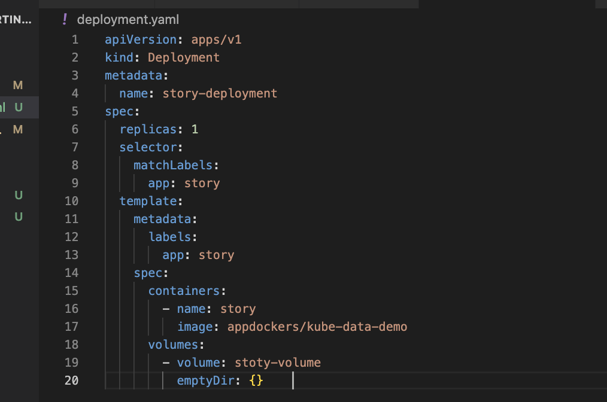

1. git clone 
2. to build image use $ docker-compose up -d --build   
3. open postman and run api localhost:3000/story get request 
4. also run some post request localhost:3000/story and send test:"mytext" in json payload then check in get request
 agin
 then stop docker-compose
 run $ docker-compose down and again run $ docker-compose up -d --build  and check get request api volume data still persist

Now lets start with kubernetes

Step 1: create deployment.yaml 
--------------------------------------------------------------
apiVersion: apps/v1
kind: Deployment
metadata:
  name: story-deployment
spec:
  replicas: 1
  selector: 
    matchLabels:
      app: story
  template:
    metadata:
      labels:
        app: story
    spec:
      containers:
        - name: story
          image: appdockers/kube-data-demo  

--------------------------------------------------------------
service.yaml file
--------------------------------------------------------------
apiVersion: v1
kind: Service
metadata:
  name: story-service
spec:
  selector:
    app: story
  type: LoadBalancer  
  ports:
    - protocol: "TCP"
      port: 80
      targetPort: 3000    

Step 2: lets create repo on docker hub and create image and push on docker hub

$ docker build -t appdockers/kube-data-demo .   

$ docker push appdockers/kube-data-demo 

$ kubectl apply -f=service.yaml -f=deployment.yaml

$ kubectl get service 
NAME            TYPE        CLUSTER-IP       EXTERNAL-IP   PORT(S)   AGE
kubernetes      ClusterIP   10.96.0.1        <none>        443/TCP   40h
story-service   ClusterIP   10.101.156.168   <none>        80/TCP    16s

then start service
$ minikube service story-service
o/p |-----------|---------------|-------------|---------------------------|
| NAMESPACE |     NAME      | TARGET PORT |            URL            |
|-----------|---------------|-------------|---------------------------|
| default   | story-service |          80 | http://192.168.49.2:31301 |
|-----------|---------------|-------------|---------------------------|
🏃  Starting tunnel for service story-service.
|-----------|---------------|-------------|------------------------|
| NAMESPACE |     NAME      | TARGET PORT |          URL           |
|-----------|---------------|-------------|------------------------|
| default   | story-service |             | http://127.0.0.1:61063 |
|-----------|---------------|-------------|------------------------|

Step 3: use the ip address http://127.0.0.1:61063 to call the api from postman 

both api will work the proble will come when the container cresh or restart 
all data will lost

to solve this we will use volume

kuber netes soppourt broad varity of types and driver for volume
we will cover 
emptyDir
hostPath
CSI

Step4 :
emptyDir Volume

will add error route in app.js to crash the container 
 add will add volume in deployment.yaml
   

emptyDir: 
          its create a empty dir when a pods will start and filled with data as long as the pod is live  
          container  will right data init and persist data if container will restart but when the pod is recreated its lost the data and initialize with empty directory

